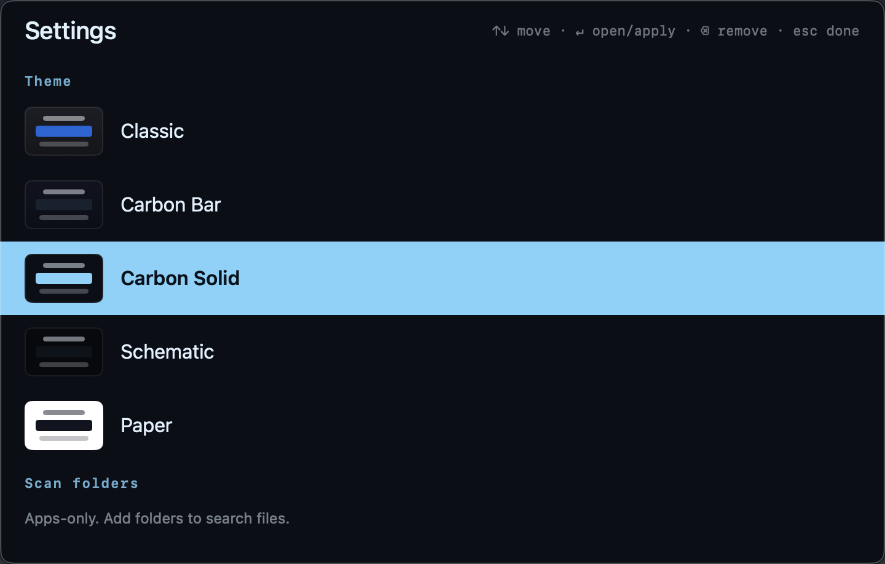
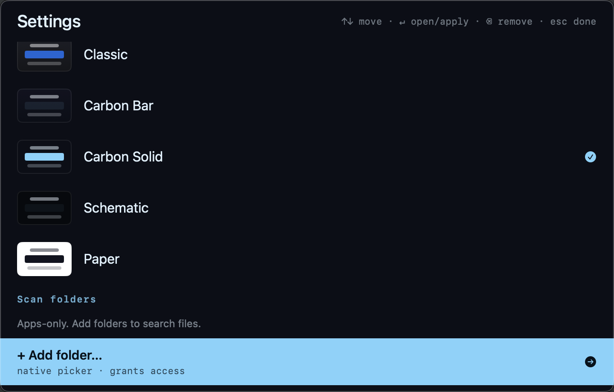

# Photon

**⌥Space, type, go.** A fast, offline Spotlight replacement for macOS.


## Why

Built by one person for the thing most launchers forget: *speed*. No background
agent, no network, no bloat — it indexes your apps once, then searches from
memory. Keystrokes in, results out.

It's a small project by one developer. Found a bug? Want a feature? This is open
software — clone it, run `swift build`, and **feel free to use your own agents
to fix it**. Contributions welcome.

## Install

```bash
swift run photon-overlay
```

⌥Space opens the overlay. Type. Enter launches. That's it.

## Features

- **Apps always searchable** — no setup, no permissions on first run
- **5 themes** — Classic, Carbon Bar, Carbon Solid, Schematic, Paper
- **Files opt-in** — add folders in Settings via the native picker; access is
  granted per-folder (no broad permission dialogs)
- **Calculator** — type `2^10`, Enter copies the answer
- **Instant slots** — ⌘1–9 launches the first rows instantly

## Screenshots






## Keys

| Key | Action |
|-----|--------|
| `⌥Space` | Toggle overlay |
| `↑` `↓` | Navigate (wraps) |
| `Enter` | Open |
| `⇧Enter` | Reveal in Finder |
| `⌘1–9` | Launch 1st–9th home row |
| `⌘,` | Settings |
| `Esc` | Close |

## Config

`~/.config/photon/config.json` — scan folders, per-folder depth/caps, theme.

## Privacy

Offline. No tracking. Per-folder access via the native picker only.

## Build

```bash
swift build
swift run photon-overlay    # the overlay
swift run photon            # CLI to configure scan folders
```

Release builds: `scripts/build_release.sh` (signed `.app` + zip).
